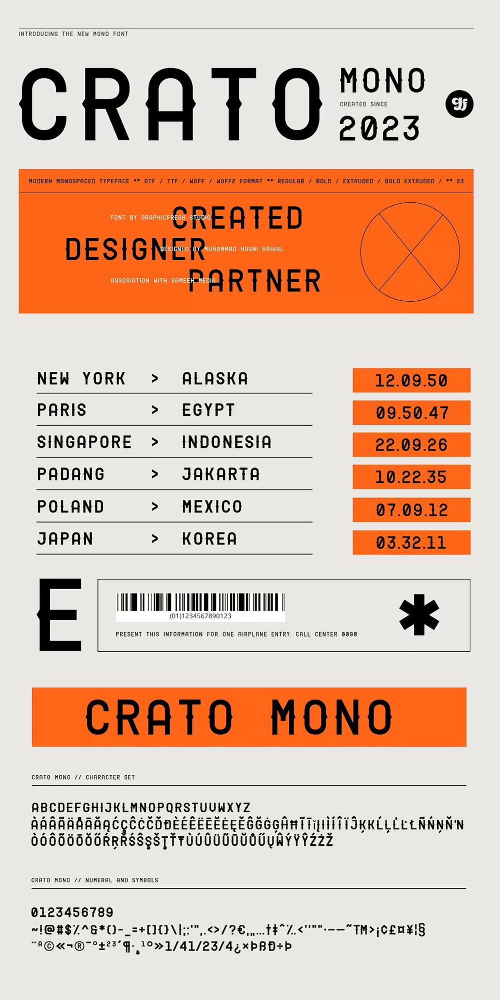
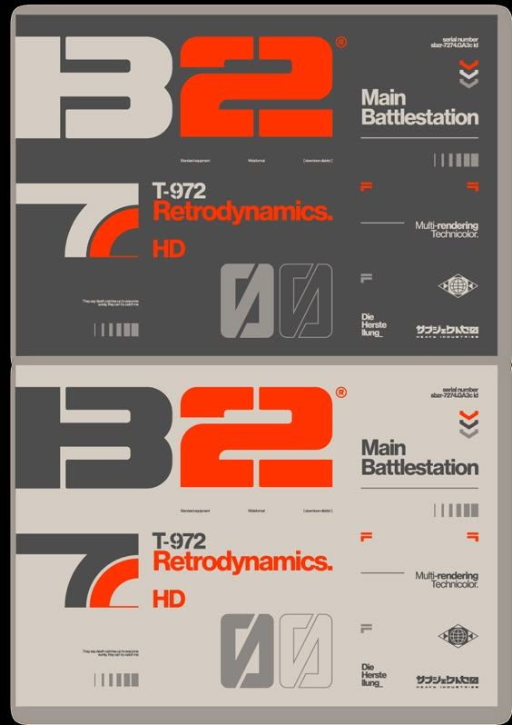
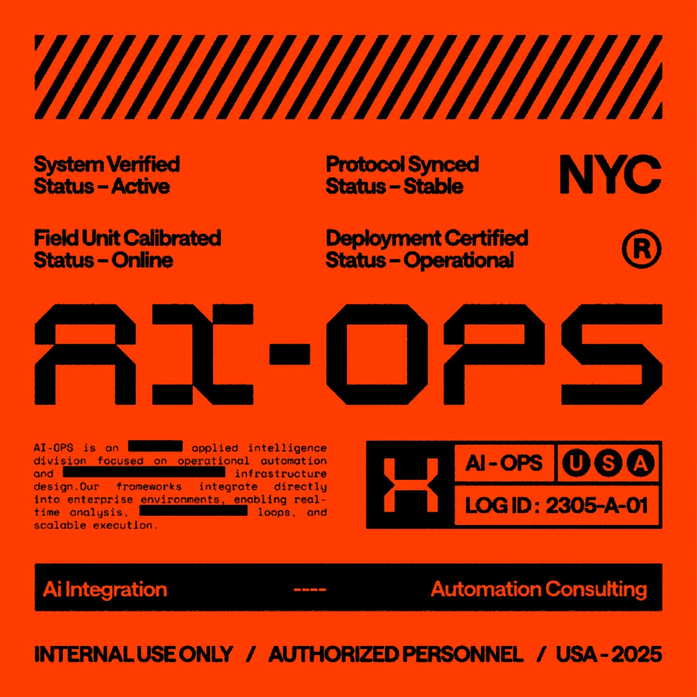

# REFERENCE — lok-ai.pl

> Artefakt ETAP B (CCUD). Konkretny materiał + kompresja do estetyki i guardraili.
> Status: `confirmed` (bramka 2: 2026-09-09)
> Rundy: 1 | Kandydatów łącznie: 12 (9 stron + 3 wrzuty z Pinteresta) | KEEP: 6

Runda zatrzymana po pierwszym przebiegu: sześć KEEP-ów dzieli cztery cechy strukturalne
(próg: ≥2), więc druga runda dałaby już tylko odcienie. Trzy wrzuty użytkownika niosły
więcej niż dziewięć stron z mojej listy — tak samo jak przy LAB247.

---

## ESTETYKA

> tabliczkowa, dwubiegunowa, strzałkowa, monospace'owa, sygnałowa, płaska, odczytowa

| Słowo | Mechanizm — konkretna decyzja, którą to słowo wymusza |
|-------|------------------------------------------------------|
| **tabliczkowa** | Jednostką układu jest **tabliczka znamionowa / etykieta**, nie karta: ramka 1 px, pasek nagłówka z metadanymi w mono (numer, data, miejsce), wiersze danych, stopka z kodem. Jeden poziom pojemnika, zero zagnieżdżeń. (R1, R2, R3, R4) |
| **dwubiegunowa** | W każdym widoku **dwa podłoża**: ciepła jasna etykieta (papier, biegun „lokalnie / tradycja") i grafitowa płyta (biegun „świat / technologia"). Ta sama tabliczka istnieje w obu wariantach (R2). Przekaz „lokalne × globalne" niesie zestawienie materiałów, nie hasło. |
| **strzałkowa** | Główny element hero to **wiersze `A > B`**: `Grudziądz > świat`, `faktura ręczna > 0 min`, `sprawdzona technologia > prosta rzecz` (R1: `POLAND > MEXICO`). To jest „konwerter" z briefu narysowany, nie opisany. Znak `>` jest jedynym symbolem strzałki w serwisie. |
| **monospace'owa** | Wszystkie dane, etykiety, metadane i nawigacja pomocnicza w **mono**; display w **rozszerzonym kroju technicznym** (Chakra Petch zostaje — to jest zachowany „charakter"); proza w grotesku z realnym kontrastem klasy wobec mono. Hierarchia z wielkości i wagi, nie z koloru. |
| **sygnałowa** | **Jeden gorący kolor** (pomarańcz sygnałowy, rodowód: obecny `coral #ef7955` podgrzany do ~`#ec3d0a`) i **żaden inny akcent**. Występuje wyłącznie jako sygnał: CTA, aktywny stan, wartość w wierszu danych, pasek ostrzegawczy. ≤ 10 % powierzchni ekranu. |
| **płaska** | Zero cieni, zero gradientów, zero poświat (`AuroraBg` wylatuje). Rozdzielanie regułami 1 px i zmianą podłoża. Promień 0 lub 2 px systemowo. |
| **odczytowa** | Ruch istnieje tylko jako **odczyt**: zmiana statusu, licznik liczony z danych, pasek przesuwu z realnymi pozycjami, migotanie kursora w polu. Zero fade-in na scroll, zero parallaxu. „Energia" strony = coś tu pracuje, nie coś tu lata. |

**Pokrętła:** `DESIGN_VARIANCE 7/10` · `MOTION_INTENSITY 5/10` · `VISUAL_DENSITY 7/10`

Odchylenie od briefu (8 / 6 / 6): KEEP-y użytkownika (teenage.engineering, Daylight, Linear)
są **uporządkowane**, nie chaotyczne — wariancja w dół; wiersze danych jako element główny —
gęstość w górę; ruch tylko odczytowy — motion w dół o 1.

---

## GUARDRAILS

### CHCĘ — maksimum 7, każde sprawdzalne na renderze

1. **Każda sekcja jest tabliczką**: ramka 1 px + pasek nagłówka z co najmniej dwoma polami mono
   (np. `NR 03 · GRUDZIĄDZ · 2026-09`). Sprawdzenie: policzyć sekcje bez paska — ma być 0.
2. **Dwa podłoża na pierwszym ekranie**: jasne ciepłe ≥ 40 % i grafit ≥ 20 % powierzchni,
   na desktopie i na 390 px. Sprawdzenie: zrzut + pomiar.
3. **Jeden gorący kolor**, ≤ 10 % powierzchni ekranu, tylko CTA / stan / wartość / pasek
   ostrzegawczy. Sprawdzenie: w CSS istnieje dokładnie jeden token akcentu; grep po innych
   nasyconych barwach = 0.
4. **Hero bez hasła przechodzi test lorem ipsum**: po zamianie prozy na placeholder wiersze
   `A > B` i dwa podłoża nadal komunikują „lokalne × światowe, trudne → proste".
5. **Typografia**: display rozszerzony techniczny (Chakra Petch) tylko w H1 i liczbach; mono na
   danych i metadanych; proza ≥ 16 px, 55–75 znaków w linii; **Inter wylatuje** z roli tekstu.
6. **Ruch = odczyt**: każda animacja odpowiada zmianie danych albo stanu; zero `IntersectionObserver`
   fade-in; `prefers-reduced-motion` respektowane. Sprawdzenie: lista animacji z podanym źródłem danych.
7. **Logo AniLogo zostaje**, ale w hero ≤ 25 % szerokości (dziś 75 % i `maxHeight: 80vh`)
   i ładuje się po LCP. Sprawdzenie: LCP na telefonie < 2,5 s.

### NIE CHCĘ

**Warstwa 1 — z anty-emocji i anty-efektu (ETAP A):**
- Nic, co **onieśmiela**: żadnego rejestru militarnego z R3 (`INTERNAL USE ONLY`, `AUTHORIZED
  PERSONNEL`, `CLASSIFIED`); etykieta ma być **cywilna** — tabliczka znamionowa, list przewozowy,
  bilet, nie rozkaz.
- Żadnego języka inwestorów („skaluj", „disruptuj", „ekosystem") ani straszenia stratą.
- Żadnych liczników bez źródła („400+ integracji", „<48h"). Liczba pojawia się tylko, gdy
  jest policzona z czegoś, co można kliknąć (1908 procesów, 1201 haseł, wpis z dziś).
- Żadnych nazw narzędzi (n8n, OpenAI, Flowise, ElevenLabs, Make) w warstwie brandowej:
  hero, nawigacja, tabliczki usług, stopka. Wolno w treści technicznej (słownik, procesy, wpis).
- Nic, co czyta się jako „trzech chłopaków z laptopami": brak zdjęć zespołu przy laptopie,
  brak mockupów laptopa w perspektywie.

**Warstwa 2 — z anty-referencji kategorii (agisona, tantor, dataone, lok-ai dziś):**
- `AuroraBg` i każda gradientowa poświata w tle.
- Kafle usług z emoji jako ikonami (⚙️💬📞🧠) — emoji wylatują całkowicie.
- Badge nad nagłówkiem („Nowa era · kwiecień 2026").
- Rząd liczników w hero.
- Pasek tickera z newsami bez źródła i godziny (ticker wolno **tylko** z realnych danych, jak pasek nasłuchu).
- Trzy plany cenowe ze środkowym „popularnym".
- Pasek logotypów integracji / „zaufali nam".
- Dwaj founderzy w dwóch kolumnach, neonowe logo, „oblicz swoją stratę".
- Kafle sprzętu Starter / Business / Enterprise ze specyfikacją jako lista parametrów.
- Kontur mapy Polski jako ozdoba w tle (mapa wolno **tylko** jako instrument: współrzędne, punkt, trasa).

**Warstwa 3 — blokada AI-slopu (wstrzyknięta automatycznie):**
```
Inter/Roboto/Open Sans/DM Sans/Poppins jako font domyślny · gradient fiolet→niebieski ·
gradientowy tekst w nagłówku · karta w karcie · szary tekst na kolorowym tle ·
czysty #000 i nietintowane szarości · zaokrąglony kwadracik z ikoną nad nagłówkiem ·
trzy kolumny cech z ikonami · wycentrowany hero z dwoma przyciskami · pill/badge nad
nagłówkiem · shadow-lg na wszystkim · easing bounce/elastic · emoji jako ikony ·
szary pasek „zaufali nam" · glassmorphism i rozmyte plamy w tle · fale i skosy między
sekcjami · stock: zespół przy laptopie · corporate memphis · mockup laptopa w perspektywie
```
Pełna lista z kontrposunięciami: `references/anti-slop.md` (skill CCUD).

---

## Referencje przyjęte

### R1 — wrzut użytkownika: specimen „Crato Mono" (Pinterest)



- **WEŹ:** wiersze trasy `NEW YORK > ALASKA` z wartością w pomarańczowym polu po prawej —
  **to jest gotowy mechanizm „konwertera"**; pasek pełnego koloru jako nagłówek sekcji z mono
  w wersalikach; ciepła jasna szarość jako podłoże (`~#e6e4de`); metadane w 10–11 px mono nad
  każdym blokiem; kod kreskowy / znak `*` jako detal.
- **ZOSTAW:** krój display z szeryfowymi „kolcami" (Crato) — za bardzo plakatowy, walczyłby
  z Chakra Petch; ilość pomarańczu (tu ~35 % powierzchni — u nas ≤ 10 %); pełny zestaw znaków
  jako sekcja (to specimen, nie strona).
- **DLACZEGO DZIAŁA:** treść jest **zorganizowana jak dokument przewozowy**, więc oko czyta
  strukturę zanim przeczyta słowa. Pary `A > B` niosą relację (skąd → dokąd) bez jednego zdania —
  dokładnie warunek „hasła niepotrzebne".
- **TOKENY:** podłoże ciepłe `#e6e4de` · akcent `#ec3d0a` · mono 11/14/18 px · reguła 1 px `#1a1a1a` ·
  wiersz danych 48 px · pole wartości = akcent + tekst ciemny.

### R2 — wrzut użytkownika: tabliczka „B22 / Retrodynamics" w dwóch wariantach (Pinterest)



- **WEŹ:** **ta sama tabliczka w wersji grafitowej i jasnej** — to jest mechanizm
  „dwubiegunowa": lokalne (jasne, papier) i światowe (grafit, płyta) jako dwa warianty jednego
  systemu, nie dwa systemy; numer seryjny w rogu; grotesk (tu Helvetica-podobny) obok
  displayu o dużej masie; drobne symbole rejestracyjne jako rytm.
- **ZOSTAW:** estetyka retro-sci-fi (katakana, „Battlestation", ciężkie cyfry z lat 70.) —
  czyta się jako gadżet, nie jako firma; mieszanie czterech skal typograficznych na jednej
  tabliczce.
- **DLACZEGO DZIAŁA:** dwa warianty obok siebie mówią „to jest system, nie obrazek". Grafit
  `~#3a3d40` zamiast czerni i kość słoniowa `~#e2ded4` zamiast bieli — oba podłoża tintowane,
  więc para nie jest zimna.
- **TOKENY:** grafit `#2b2e31` (płyta) · kość `#e2ded4` (papier) · akcent ten sam na obu ·
  pasek metadanych 9–10 px · symbol rejestracyjny 12 px.

### R3 — wrzut użytkownika: etykieta „AI-OPS" (Pinterest)



- **WEŹ:** **siatka statusów** `System Verified / Status – Active` w czterech polach — to jest
  „odczyt" jako element brandowy (u nas: realne stany z n8n / z serwera klienta); pasek
  ostrzegawczy w ukośne pasy jako nagłówek; blok `LOG ID: 2305-A-01` jako stopka; pole
  redakcyjne z zaczernieniami (mono, prostokąty) jako faktura tekstu.
- **ZOSTAW:** pomarańcz jako podłoże całości (u nas sygnał, nie tło); rejestr **militarny**
  (`INTERNAL USE ONLY`, `AUTHORIZED PERSONNEL`, `USA-2025`) — wprost łamie anty-emocję
  „onieśmielenie"; display z ukosami „AI-OPS" (za blisko gier).
- **DLACZEGO DZIAŁA:** pola statusu dają wrażenie, że **coś działa w tej chwili**, bez
  jednego zdania marketingowego. To jest „energia" z briefu w wersji, która nie lata po ekranie.
- **TOKENY:** siatka statusów 2×2 → u nas 1×4 na desktopie, 2×2 na telefonie · pasy 45°
  8 px jako pasek ostrzegawczy (tylko jeden na stronę) · `LOG ID` = data + numer wpisu.

### R4 — teenage.engineering (KEEP użytkownika, K1)

- **WEŹ:** produkt jako **przedmiot na płaskim tle** (u nas: komputer z lokalnym modelem na
  jasnym podłożu, bez sceny); mono jako krój nawigacji i cen; specyfikacja jako główna treść
  strony produktu; brak zdjęć „lifestyle".
- **ZOSTAW:** chłodna biel jako podłoże (u nas ciepłe); ilość produktów w siatce sklepowej;
  język żartobliwy.
- **DLACZEGO DZIAŁA:** przedmiot na płaskim tle mówi „to istnieje, można kupić, nie ma
  czego ukrywać" — to jest jedyna rzecz, której agencja chmurowa nie może pokazać (brief §6).
- **TOKENY:** zdjęcie produktu na `#e6e4de` bez cienia · podpisy mono 12 px · cena jako
  wiersz danych, nie badge.

### R5 — daylightcomputer.com (KEEP użytkownika, K4)

- **WEŹ:** **ciepło jako argument** — bursztynowe światło zamiast niebieskiego to jest cały
  przekaz i nie potrzebuje zdania; jedno zdjęcie na sekcję, duże; spokój tempa.
- **ZOSTAW:** zdjęcia w plenerze (trawa, kwiaty) — u nas przedmiot stoi w biurze klienta;
  ilość powietrza (Daylight ma DENSITY 3, my 7); miękkość.
- **DLACZEGO DZIAŁA:** temperatura barwowa niesie pozycjonowanie („nie jesteśmy zimną
  technologią") — u nas robi to ciepłe podłoże etykiety i pomarańcz sygnałowy.
- **TOKENY:** neutrale tintowane w stronę bursztynu (+8–12° hue) · zero czystej bieli.

### R6 — linear.app (KEEP użytkownika, K8 — test „nowoczesności")

- **WEŹ:** **ostra siatka** z widocznymi liniami podziału; grafit zamiast czerni; jeden
  krój na interfejs; precyzja odstępów (skala 4 px); ruch tylko przy zmianie stanu.
- **ZOSTAW:** cały ciemny tryb jako jedyne podłoże (u nas grafit to **jeden z dwóch** biegunów);
  gradientowe poświaty za ilustracjami; rejestr SaaS („plan, build, ship").
- **DLACZEGO DZIAŁA:** siatka z regułami mówi „zaprojektowane", nie „ułożone" — to jest
  mechanizm „nowoczesności", który użytkownik zaakceptował, przetłumaczony na linie, nie na
  ciemność.
- **TOKENY:** reguły `rgba(0,0,0,.12)` na jasnym / `rgba(255,255,255,.10)` na grafitcie ·
  skala odstępów 4 · 8 · 16 · 32 · 64 · przejścia stanu 120–160 ms `ease-out`.

---

## Zbieżność

**Cechy strukturalne wspólne dla KEEP-ów:**
- **Sekcja jako tabliczka / etykieta** (ramka, pasek nagłówka, metadane, stopka z kodem) — R1, R2, R3, R4
- **Dane w wierszach klucz `>` wartość jako element główny, nie dodatek** — R1, R3, R4, R6
- **Hero prowadzone typografią, bez zdjęcia sceny** — R1, R2, R3, R6 (R4/R5 mają przedmiot, ale też bez sceny)
- **Hierarchia z wielkości i wagi jednego systemu krojów, nie z koloru** — R1, R2, R4, R6

Cztery cechy przy progu dwóch → runda 2 zbędna.

**Cechy powierzchniowe wspólne** (informacyjnie): pomarańcz sygnałowy na ciepłej jasnej szarości
(R1, R2, R3), grafit tintowany zamiast czerni (R2, R6), ciepło jako temperatura, nie jako
„kremowość" (R5). Obecna paleta lok-ai (amber/coral/sand/rust) **redukuje się do jednego
sygnału** — reszta ciepła przechodzi do podłoża.

**Napięcie do rozstrzygnięcia w ETAP C** (nie rozbieżność): proporcja biegunów. R2 i R6 ciągną
w grafit, R1/R3/R4/R5 w jasne. Trzy kierunki w ETAP C obejmą: jasny z grafitowymi wstawkami /
grafitowy z jasnymi tabliczkami / 50:50 podział ekranu.

---

## Odrzucone — materiał do bazy wiedzy

Użytkownik podał KILL bez powodów. Powody poniżej to **domysł z delty KEEP↔KILL**
(KEEP-y: uporządkowane, prowadzone typografią lub przedmiotem, jeden akcent; KILL-e:
fotografia sceny, kolor jako tło, rejestr zabawy lub domu, katalog).

| Kandydat | Powód KILL |
|----------|------------|
| K2 ableton.com | `[domysł]` pola pełnego koloru jako podłoże — kolor jako tło, nie sygnał; zbyt graficzne |
| K3 frame.work | `[domysł]` fotografia produktu z otwartym wnętrzem — komunikat „majsterkowanie", nie „działa" |
| K5 vitsoe.com | `[domysł]` rejestr domu i meblarstwa — zbyt cicho, brak energii |
| K6 festool.pl | `[domysł]` katalog narzędzi — gęstość sklepowa, jeden kolor jako tło marki |
| K7 felt.com | `[domysł]` produkt SaaS z mapami — mapa jako produkt, nie jako instrument tożsamości |
| K9 hackclub.com | `[domysł]` ręcznie robione, kolorowe — czyta się jako klub, nie firma |

---

## Ograniczenie procesowe (decyzja użytkownika przy bramce 2)

> „chcę, żeby nowa szata graficzna na start była tylko lokalnie, a na produkcji pozostawała
> aktualna, dopóki nie będę miał przekonania, że jest lepsza"

Konsekwencje:
- Redesign powstaje na **osobnej gałęzi** (`redesign-ccud`), nigdy na `main` — `main` deployuje
  się automatycznie na Vercel.
- Produkcja (https://www.lok-ai.pl) zostaje na obecnym designie do jawnej decyzji użytkownika.
- Dowody wyłącznie lokalne: proof HTML w `design/proof/`, potem `next dev` na gałęzi, zrzuty
  w `design/proof/shots/`. Porównanie „stare vs nowe" obok siebie jest artefaktem tej decyzji.
- Blog dzienny nadal commituje na `main`; gałąź redesignu rebase'uje się na `main`, nie odwrotnie.

## Powiązania

- Poprzedni artefakt: `design/DESIGN-BRIEF.md`
- Następny artefakt: `design/DESIGN.md`
- Wrzuty źródłowe użytkownika: `pin/p1–p3.jpg` (kopie z nazwami w `design/refs/`)
